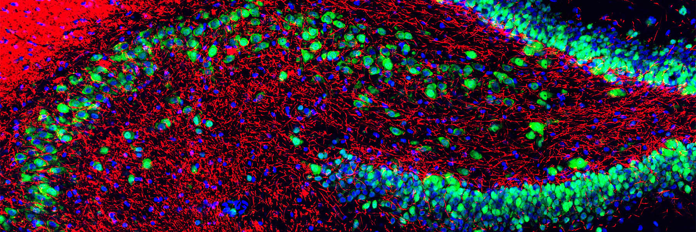

# Awesome Genetic Engineering 

_A curated list of awesome resources for genetic engineering._

 Definition From Wikipedia 

> **Genetic engineering**, also called **genetic modification** or **genetic manipulation**, is the modification and manipulation of an organism's [genes](https://en.wikipedia.org/wiki/Gene "Gene") using [technology](https://en.wikipedia.org/wiki/Technology "Technology"). It is a set of [technologies](https://en.wikipedia.org/wiki/Genetic_engineering_techniques "Genetic engineering techniques") used to change the genetic makeup of cells, including the transfer of genes within and across species boundaries to produce improved or novel [organisms](https://en.wikipedia.org/wiki/Organisms "Organisms"). New [DNA](https://en.wikipedia.org/wiki/DNA "DNA") is obtained by either isolating and copying the genetic material of interest using [recombinant DNA](https://en.wikipedia.org/wiki/Recombinant_DNA "Recombinant DNA") methods or by [artificially synthesising](https://en.wikipedia.org/wiki/Artificial_gene_synthesis "Artificial gene synthesis") the DNA. A construct is usually created and used to insert this DNA into the host organism. The first recombinant DNA molecule was made by [Paul Berg](https://en.wikipedia.org/wiki/Paul_Berg "Paul Berg") in 1972 by combining DNA from the monkey virus [SV40](https://en.wikipedia.org/wiki/SV40 "SV40") with the [lambda virus](https://en.wikipedia.org/wiki/Lambda_phage "Lambda phage"). As well as inserting [genes](https://en.wikipedia.org/wiki/Gene "Gene"), the process can be used to remove, or "[knock out](https://en.wikipedia.org/wiki/Gene_knockout "Gene knockout")", genes. The new DNA can either be inserted randomly or [targeted](https://en.wikipedia.org/wiki/Gene_targeting "Gene targeting") to a specific part of the [genome](https://en.wikipedia.org/wiki/Genome "Genome"). [[1](https://en.wikipedia.org/wiki/Genetic_engineering#cite_note-1)] [^wikipedia_citation]

[^wikipedia_citation]: Wikipedia contributors. "Genetic engineering." Wikipedia. Last modified September 30, 2025. Accessed October 24, 2025. <https://en.wikipedia.org/wiki/Genetic_engineering>.

 [^image_attribution]

[^image_attribution]: This file is licensed under the [Creative Commons](https://en.wikipedia.org/wiki/en:Creative_Commons "w:en:Creative Commons") [Attribution-Share Alike 3.0 Unported](https://creativecommons.org/licenses/by-sa/3.0/deed.en "creativecommons:by-sa/3.0/deed.en") license. Image Changed Made: None. Image Link: <https://commons.wikimedia.org/wiki/File:Rat_hippocampus_stained_with_antibody_to_NeuN_(green),_myelin_basic_protein_(red)_and_DNA_(blue).jpg>. Image Description: "This is a section of adult rat hippocampus stained with antibody to the neuronal nucleus and perikaryal antibody [NeuN](https://en.wikipedia.org/wiki/NeuN "en:NeuN") (a.k.a. Fox3) in green and antibody to myelin basic protein (MBP) in red. The MBP reveals neuronal axons while the NeuN antibody reveals neurons but not non neuronal cells. The fluorescent blue DNA stain [DAPI](https://en.wikipedia.org/wiki/DAPI "en:DAPI") was used to stain nuclei on neurons and non-neuronal cells. Antibodies and imaging courtesy of [EnCor Biotechnology Inc](https://en.wikipedia.org/wiki/EnCor_Biotechnology_Inc "en:EnCor Biotechnology Inc").".

> [!NOTE]
>
> This list follows specific scoping guidelines. The **Books** section primarily contains textbooks. **Organizations** is divided into GitHub organizations and non-GitHub organizations. **Researchers** exclusively features researcher GitHub profiles. A **Reading Lists** section was chosen over individual papers, as managing the volume of papers on the topic at hand in a single list in untenable. **Repositories** targets larger work on GitHub and excludes, for example, standalone code for papers. **Datasets** includes only publicly accessible data. **Software** features notable tools, libraries, and frameworks not available on GitHub. **Websites** covers informational sites, news sources, and community hubs. **Educational Resources** includes tutorials, videos, and other learning materials.

## Contents

- [Books](#books)
- [Journals](#journals)
- [Conferences](#conferences)
- [Organizations](#organizations)
- [Researchers](#researchers)
- [Courses](#courses)
- [Reading Lists](#reading-lists)
- [Repositories](#repositories)
- [Datasets](#datasets)
- [Software](#software)
- [Websites](#websites)
- [Educational Resources](#educational-resources)
- [Contribution](#contribution)
- [License](#license)

## Books

1. [The CRISPR Generation: The Story of the World's First Gene-Edited Babies](https://www.amazon.com/CRISPR-Generation-Story-Worlds-Gene-Edited/dp/0358223598): Kiran Musunuru on He Jiankui case.
2. [A Crack in Creation: Gene Editing and the Unthinkable Power to Control Evolution](https://www.amazon.com/Crack-Creation-Editing-Unthinkable-Evolution/dp/0544716949): Jennifer Doudna and Samuel Sternberg.
3. [The Gene: An Intimate History](https://www.amazon.com/Gene-Intimate-History-Siddhartha-Mukherjee/dp/147673352X): Siddhartha Mukherjee on the history of genetics.
4. [Regenesis: How Synthetic Biology Will Reinvent Nature and Ourselves](https://www.amazon.com/Regenesis-Synthetic-Biology-Reinvent-Ourselves/dp/0465075703): George Church and Ed Regis.
5. [Life at the Speed of Light: From the Double Helix to the Dawn of Digital Life](https://www.amazon.com/Life-Speed-Light-Double-Digital/dp/0670025402): Craig Venter on synthetic genomics.
6. [The Code Breaker: Jennifer Doudna, Gene Editing, and the Future of the Human Race](https://www.amazon.com/Code-Breaker-Jennifer-Editing-Future/dp/1982115858): Walter Isaacson biography.

## Journals

1. [Nature Biotechnology](https://www.nature.com/nbt/): Leading biotechnology research journal.
2. [Cell](https://www.cell.com/): Molecular and cell biology, including genetic engineering.
3. [Science](https://www.science.org/): Multidisciplinary science including genetic engineering advances.
4. [CRISPR Journal](https://www.liebertpub.com/journal/crispr): Dedicated to CRISPR research and applications.
5. [Molecular Therapy](https://www.cell.com/molecular-therapy-family/molecular-therapy/home): Gene therapy and genetic medicine.
6. [ACS Synthetic Biology](https://pubs.acs.org/journal/asbcd6): Synthetic biology research.

## Conferences

1. [CRISPR Conference](https://crisprconference.org/): Annual meeting focused on CRISPR technologies and applications.
2. [American Society of Gene & Cell Therapy (ASGCT) Annual Meeting](https://annualmeeting.asgct.org/): Major gene therapy conference.
3. [Genome Editing Congress](https://www.terrapinn.com/conference/genome-editing/): International conference on genome editing technologies.
4. [Synthetic Biology: Engineering, Evolution & Design (SEED)](https://seed.synbiobeta.com/): Conference on synthetic biology applications.
5. [International Summit on Human Gene Editing](https://www.nationalacademies.org/): Periodic international meetings on heritable genome editing.

## Organizations

### GitHub Organizations

1. [Broad Institute](https://github.com/broadinstitute): Genomic medicine and research organization with extensive open-source tools.

### Other Organizations

1. [CRISPR Therapeutics](https://crisprtx.com/): Clinical-stage biotech company.
2. [The Innovative Genomics Institute](https://innovativegenomics.org/): UC Berkeley research institute.
3. [Broad Institute](https://www.broadinstitute.org/): Genomic medicine and research.
4. [Synthetic Biology Engineering Research Center](https://synberc.org/): SynBERC research consortium.
5. [International Society for Stem Cell Research (ISSCR)](https://www.isscr.org/): Stem cell and genetic engineering guidelines.
6. [WHO Registry of Human Genome Editing](https://www.who.int/groups/expert-advisory-committee-on-developing-global-standards-for-governance-and-oversight-of-human-genome-editing): International oversight.
7. [Nuffield Council on Bioethics](https://www.nuffieldbioethics.org/topics/genome-editing): Ethical frameworks.
8. [Center for Genetics and Society](https://www.geneticsandsociety.org/): Public interest advocacy.
9. [NASEM Genome Editing Resources](https://www.nationalacademies.org/topics/genome-editing): Reports and guidelines.

## Researchers

1. [George Church](https://github.com/church-lab): Harvard geneticist pioneering synthetic biology and genome engineering.
2. ...

## Courses

1. [Genome Editing (edX)](https://www.edx.org/): CRISPR and gene editing fundamentals.
2. [Introduction to Synthetic Biology (MIT OpenCourseWare)](https://ocw.mit.edu/courses/biological-engineering/): Free MIT synthetic biology course.
3. [CRISPR: A Revolution in Genome Editing (FutureLearn)](https://www.futurelearn.com/): University of Melbourne course on CRISPR technology.
4. [Genetics and Society: A Course for Educators (Coursera)](https://www.coursera.org/learn/genetics-society): American Museum of Natural History genetics course.
5. [Molecular Biology (Khan Academy)](https://www.khanacademy.org/science/ap-biology/gene-expression-and-regulation): Free molecular biology fundamentals.

## Reading Lists

1. [O957's Papers](assets/o957_reading_list.md)

## Repositories

1. [Benchling CRISPR](https://github.com/benchling/crispr): CRISPR design and analysis tools.
2. [CRISPResso2](https://github.com/pinellolab/CRISPResso2): Analysis of genome editing outcomes.
3. [GUIDES](https://github.com/pritykinlab/guidescan-cli): Genome-wide guide RNA design.
4. [Cas-OFFinder](https://github.com/snugel/cas-offinder): CRISPR off-target detection.
5. [chopchop](https://github.com/valenlab/chopchop): Web tool for CRISPR design.
6. [GeneMark](https://github.com/davidji99/genemark): Gene therapy vector design tools.
7. [AAV-Tools](https://github.com/broadinstitute/aav-tools): Adeno-associated virus engineering.
8. [CARTcells](https://github.com/immunotherapy/cart-design): CAR-T cell design platform.
9. [iGEM Registry](https://github.com/SynBioHub/synbiohub): Standard biological parts registry.
10. [Cello](https://github.com/CIDARLAB/cello): Genetic circuit design automation.
11. [j5](https://github.com/TeselaGen/jbei-ice): DNA assembly design tool.
12. [SBOL](https://github.com/SynBioDex/pySBOL3): Synthetic Biology Open Language tools.
13. [PlantCV](https://github.com/danforthcenter/plantcv): Plant phenotyping and analysis.
14. [AgBioData](https://github.com/agbiodata/data-resources): Agricultural genomics databases.
15. [CropPAL](https://github.com/croppal/croppal): Crop genome editing design.
16. [MGDrivE](https://github.com/MarshallLab/MGDrivE): Mosquito gene drive explorer simulation.
17. [SLiM](https://github.com/MesserLab/SLiM): Forward genetic simulation including gene drives.
18. [genedrive-model](https://github.com/messerlab/gene-drive-simulations): Gene drive population dynamics.
19. [embryo-editing-analysis](https://github.com/ethicsAI/germline-editing): Ethical analysis tools.
20. [germline-simulator](https://github.com/genomics/heritability-models): Modeling germline modifications.

## Datasets

## Software

1. [Benchling](https://www.benchling.com/): Molecular biology research platform.
2. [SnapGene](https://www.snapgene.com/): DNA sequence visualization and analysis.
3. [Geneious](https://www.geneious.com/): Molecular biology and bioinformatics software.
4. [BLAST](https://blast.ncbi.nlm.nih.gov/): Sequence similarity search.
5. [Primer3](https://primer3.org/): PCR primer design.
6. [APE](https://jorgensen.biology.utah.edu/wayned/ape/): Plasmid editor.

## Websites

1. [Addgene Educational Resources](https://www.addgene.org/mol-bio-reference/): Molecular biology reference materials.
2. [HHMI BioInteractive](https://www.biointeractive.org/classroom-resources/crispr-cas-9-mechanism-applications): CRISPR educational materials.
3. [Nature Scitable](https://www.nature.com/scitable/topic/genetic-engineering-12/): Genetic engineering learning resources.

## Educational Resources

1. [CRISPR Course (MIT OpenCourseWare)](https://ocw.mit.edu/courses/biology/7-016-introductory-biology-fall-2018/): Introduction to molecular biology.
2. [Khan Academy Genetics](https://www.khanacademy.org/science/ap-biology/gene-expression-and-regulation): Free genetics courses.

## Contribution

Notice anything missing that would be a good fit? If interested in contributing, please see the [contributing file](./CONTRIBUTING.md) for further direction.

## License

To the extent possible under law, [O957](https://github.com/O957) has waived all copyright and related or neighboring rights to this work.
